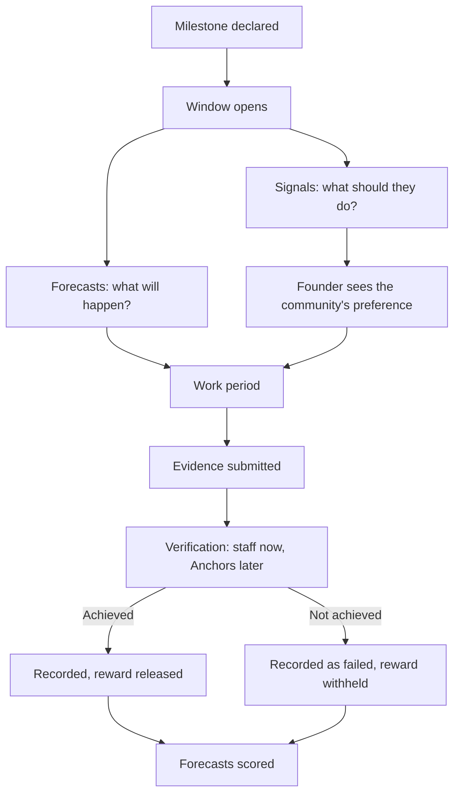

# Signal Mechanics

## How Signalling and Forecasting Actually Work

<h3>⚙️ The Short Version</h3>

Studio3 has no token. As an Echo you have two free actions: a <strong>Signal</strong>, which says what a
venture should do, and a <strong>Forecast</strong>, which says what will actually happen. Nothing is bought,
staked, locked, or burned.

!!! note "Being built, not yet live"
    Evidence submission, Arena-held rewards, Drops and Bounties are settled decisions that are still
    being built. This page describes the model.

## Signals

### What a Signal Does

A Signal is a preference expressed on an open question the venture has asked.

<h3>✅ Support</h3>

<ul>
<li><strong>Cost:</strong> nothing</li>
<li><strong>Shape:</strong> yes/no, or A-or-B</li>
<li><strong>Visible:</strong> immediately, to the founder and the community</li>
<li><strong>Changeable:</strong> while the question is open</li>
<li><strong>Scored:</strong> never</li>
</ul>

Support tells the venture you think it should go ahead, or should take this option.

<h3>❌ Doubt</h3>

<ul>
<li><strong>Cost:</strong> nothing</li>
<li><strong>Shape:</strong> the same question, the other answer</li>
<li><strong>Visible:</strong> immediately, with the same weight as support</li>
<li><strong>Changeable:</strong> while the question is open</li>
<li><strong>Scored:</strong> never</li>
</ul>

Doubt is a contribution. A founder who cannot answer it has learned something important.

!!! warning "A Signal is not a prediction"
    Signals have no resolvable outcome, so they are never right or wrong and can never be scored,
    settled, or attached to money. If the question you are answering is "will this happen?", you
    want a Forecast.

### Signal Weight

Every Echo's Signal counts the same. There is nothing to hold that gives you a bigger voice, and
nothing to buy that amplifies you. What a high progression title changes is how seriously people
read your reasoning, not how much your vote counts.

## Forecasts

### What a Forecast Does

A Forecast is a probability on a question that will definitely be settled.

<h3>🎯 Forecast Specifications</h3>

<ul>
<li><strong>Cost:</strong> nothing</li>
<li><strong>Shape:</strong> a probability on a question written once, in resolvable form</li>
<li><strong>Window:</strong> open until the milestone deadline or an earlier cut-off</li>
<li><strong>Changeable:</strong> while the window is open; your last position is what counts</li>
<li><strong>Scored:</strong> always, against the verified outcome</li>
</ul>

### How Forecasts Are Scored

The milestone is verified as achieved or not achieved, and your forecast is compared to what
happened.

- A confident forecast that proves right helps your record more than a hedged one.
- A confident forecast that proves wrong hurts it more.
- Skipping a question does nothing to your record at all.

Over time this produces two numbers worth caring about:

| Metric | What it means | Why it matters |
|--------|---------------|----------------|
| **Accuracy** | How often you were on the right side | The headline number |
| **Calibration** | Whether your 70% calls actually happen about 70% of the time | The honest number |

!!! tip "Calibration beats accuracy"
    It is easy to be accurate by only forecasting the obvious. Calibration is what shows you know
    how confident you should be - and it is much harder to fake.

## The Milestone Cycle

### Verification

Studio3 staff verify milestone completion at launch. Anchors take verification over as the
platform matures. Either way, the verifier checks the founder's evidence against what was
declared, and the result is recorded permanently.

### Failure

If a milestone fails, the record says so and keeps saying so. Nothing is quietly retired, for the
venture or for the Echoes who forecast wrongly.

## Reading a Signal Pool

<h3>🏊 What the Pool Tells You</h3>

<strong>The pool shows:</strong>

<ul>
<li><strong>Support versus doubt</strong> on the venture's open question</li>
<li><strong>The community's aggregate forecast</strong> on milestones that have one</li>
<li><strong>How both moved over time</strong>, and what news moved them</li>
</ul>

<strong>How to use it:</strong>

<ul>
<li><strong>Form your own view before you look.</strong> Anchoring on the crowd is the fastest way to become badly calibrated.</li>
<li><strong>Look at the movement, not the level.</strong> A forecast that jumped 20 points in a day means something happened.</li>
<li><strong>Extremes are worth questioning.</strong> A milestone the crowd is certain about is either genuinely obvious or collectively misread.</li>
</ul>

## Timing

<h3>⏰ When to Weigh In</h3>

<strong>Early, before the crowd has formed a view:</strong>

<ul>
<li><strong>Worth more on your record</strong> - you called it when it was not obvious</li>
<li><strong>Least information available</strong></li>
<li><strong>Best for:</strong> questions inside your actual expertise</li>
</ul>

<strong>Mid-window, as updates arrive:</strong>

<ul>
<li><strong>Balanced</strong> - some evidence, still genuine uncertainty</li>
<li><strong>Best for:</strong> most forecasts</li>
</ul>

<strong>Late, close to the deadline:</strong>

<ul>
<li><strong>Most information, least credit</strong> - if you can see it by now, so can everybody else</li>
<li><strong>Best for:</strong> updating a view you already put on the record</li>
</ul>

!!! info "Updating is not cheating"
    Changing your forecast when the evidence changes is good forecasting. What counts against you
    is never having committed to a view while it was still hard.

## Prediction Markets

For some milestones an external prediction market may exist on **Polymarket**. Where one exists,
and where you are eligible to use it, the same forecast question can carry real money.

- **Optional** - ventures switch markets on or off, and studios set a default
- **External** - the market is Polymarket's, under Polymarket's rules, not Studio3's
- **Restricted** - Polymarket blocks trading from a long list of jurisdictions
- **Rare** - most milestones will never have one
- **Forecast-only** - money never attaches to a Signal, because a Signal has no outcome

If no market exists, or you are not eligible for one, your free forecast still counts exactly the
same towards your record. That is the normal case, and the product is complete without markets.

## Common Technical Issues

<h3>🔧 Problem Resolution</h3>

<strong>Your signal or forecast did not register:</strong>

<ul>
<li><strong>The window may have closed</strong></li>
<li>The venture may have paused signalling on that question</li>
<li>You may be signalling on your own venture, which is not allowed</li>
</ul>

<strong>Verification delays:</strong>

<ul>
<li><strong>Verification queue</strong></li>
<li>Dispute process</li>
<li>Evidence incomplete or contested</li>
</ul>

## Next Steps

Continue with:

1. [Rewards & Recognition](rewards-system.md) - what you can actually earn
2. [Due Diligence Framework](due-diligence.md) - analysis methods
3. [Reading Signals](reading-signals.md) - interpreting the community

---

!!! info "Technical Note"
    Signal and forecast mechanics evolve as the platform is built. Stay updated through official
    channels.

!!! warning "Reminder"
    Understanding the mechanics does not make you a good forecaster. Only making calls in public
    and checking them against what happened does that.
