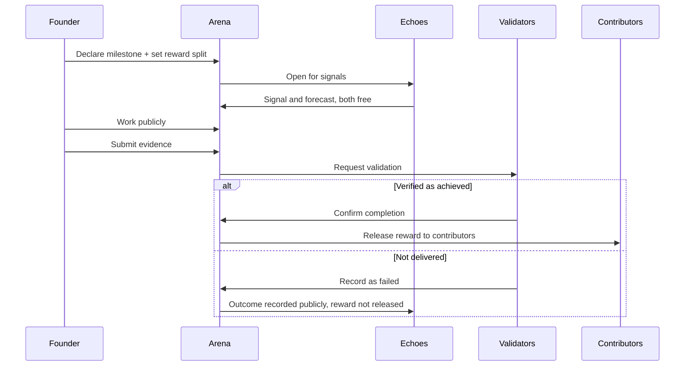
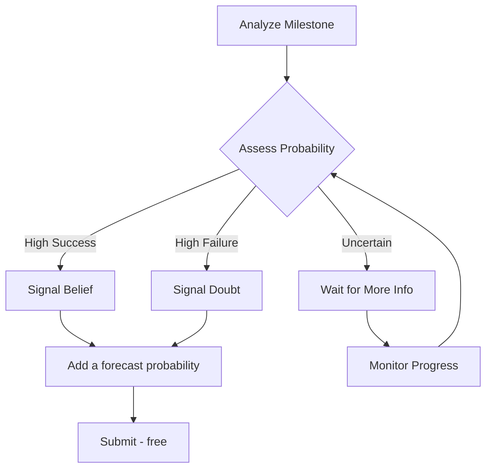

# The Arena System

## Where Ventures Prove Themselves

The Arena is Studio3's revolutionary public execution environment where ventures build, fail, and succeed under the watchful eyes of the community.

## What is an Arena?

### The Digital Colosseum

An Arena is a transparent, public space where:

- **Ventures declare** their milestones
- **Supporters signal** their belief or doubt
- **Progress unfolds** in real-time
- **Results determine** rewards and penalties
!!! quote "The Arena Philosophy"
    "In the Arena, there are no hidden failures, no private pivots, no secret struggles. Everything happens in the open, creating radical accountability."

## Arena Types

### Different Stages, Different Rules

        <h3>✨ Spark Arena</h3>
        
<strong>Purpose:</strong>

<strong>Idea validation
</strong>

        
<strong>Duration:</strong> 7-14 days

<strong>Stakes:</strong>

<strong>Initial belief gathering
</strong>

        
Where ideas compete for attention and initial support

    

        <h3>⚔️ Forge Arena</h3>
        
<strong>Purpose:</strong>

<strong>Founder selection
</strong>

        
<strong>Duration:</strong> 3-5 days

<strong>Stakes:</strong>

<strong>Venture ownership
</strong>

        
Where founders duel for the right to build

    

        <h3>🎯 Milestone Arena</h3>
        
<strong>Purpose:</strong>

<strong>Progress validation
</strong>

        
<strong>Duration:</strong>

<strong>Variable (per milestone)
</strong>

        
<strong>Stakes:</strong>

<strong>The venture's public record, and the Arena's reward
</strong>

        
Where ventures prove their execution ability

    

        <h3>✅ Validation Arena</h3>
        
<strong>Purpose:</strong>

<strong>Achievement verification
</strong>

        
<strong>Duration:</strong> 24-48 hours

<strong>Stakes:</strong>

<strong>Milestone completion
</strong>

        
Where Anchors verify claimed progress

## Arena Mechanics

### How Arenas Work

### Core Components

| Component | Function | Participants |
|-----------|----------|-------------|
| **Declaration** | Public commitment to goals + reward split | Founders |
| **Signalling** | Free support or doubt, plus free forecasts | Echoes |
| **Execution** | Transparent work toward goals | Founders |
| **Validation** | Independent verification of results | Studio3 staff, later Anchors |
| **Settlement** | Reward released by the Arena on success | The Arena |

### Arena Reward Configuration

<h3>💎 What the Arena Holds</h3>

The reward for a milestone is committed to the Arena before the work starts, and released when the
milestone is verified as achieved. It can be USDC, non-cash items such as merch, access, tickets,
credits or digital collectibles, or both.

<strong>How it is shared out:</strong> the Sender proposes how a reward is divided between the people who
contributed, contributors can dispute that proposal, and an Anchor arbitrates.

The proportions themselves are not fixed by the platform and are not yet specified here.

!!! note "Not yet live"
    Arena-held rewards, Drops, Bounties, and evidence submission are settled decisions that are
    still being built. This describes the model, not a feature you can use today.

## Arena Rules

### Universal Principles

!!! warning "Non-Negotiable Rules"
    1. **All work must be public** - No private development
    2. **All milestones are binding** - Once declared, must be attempted
    3. **All signals are public and permanently recorded** - Change one while the window is open; the history is kept
    4. **All validations are independent** - No founder influence
    5. **All settlements follow the verified outcome** - The reward is released only on verified success, and a disputed split is arbitrated by an Anchor

#### Spark Arena Rules

- A threshold of initial community support is required to proceed
- At least 10 unique supporters required
- Ideas can iterate based on feedback
- Failed Sparks can be re-submitted after 30 days

#### Forge Arena Rules

- Winner takes all 
- only one founder proceeds
- Entry is by application, not by putting anything up
- 72-hour preparation period before duel
- Judgment based on vision, capability, and commitment

#### Milestone Arena Rules

- Milestones must be SMART (Specific, Measurable, Achievable, Relevant, Time-bound)
- Minimum 48-hour signal period before work begins
- Evidence must be submitted before deadline
- Extensions only granted by Anchor majority

## Signal Dynamics

### The Belief Economy

<h3>📡 Signal Mechanics</h3>

<strong>Support Signals</strong> 👍

<ul>
<li><strong>Tell the venture you think it should go ahead</strong></li>
<li>Free to cast, visible immediately</li>
<li>A preference, not a prediction - it is never scored</li>

</ul>

<strong>Doubt Signals</strong> 👎

<ul>
<li><strong>Tell the venture you think it should not</strong></li>
<li>Equally free, equally visible</li>
<li>Constructive pressure the founder is expected to answer</li>

</ul>

<strong>Forecasts</strong> 🎯

<ul>
<li><strong>Separate from signals, and also free</strong></li>
<li>A probability on whether the milestone will actually be met</li>
<li>Scored against the verified outcome and added to your accuracy record</li>
<li>Where a prediction market exists on Polymarket and you are eligible, a forecast can carry money - this is optional, external, and rare</li>

</ul>

### Signal Strategies

## Arena Transparency

### Everything is Visible

** Public Information:**

- **All milestone declarations**
- All signals and forecasts, with timing
- All founder updates and evidence
- All validator comments and scores
- All reward distributions

** Performance Metrics:**

- **Success/failure rates by founder**
- Forecast accuracy by Echo
- Validation quality by Anchor
- Phase progression timelines
- Reward release history

## Arena Participation

### For Founders

!!! tip "Arena Best Practices"

- **Declare realistic milestones**
- Under-promise, over-deliver

- **Update progress daily**
- Keep supporters engaged

- **Share challenges openly**
- Build trust through transparency

- **Submit evidence early**
- Allow time for validation

- **Engage with feedback**
- Community wisdom is valuable

### For Echoes

!!! tip "Signaling Strategies"

- **Research thoroughly**
- Past performance predicts future

- **Forecast widely**
- A record built on one milestone says very little

- **Say why**
- Written reasoning is how you learn from outcomes

- **Monitor actively**
- Adjust strategies based on progress

- **Learn from wrong calls**
- A forecast that missed tells you where your judgement needs work

### For Anchors

!!! tip "Validation Excellence"

- **Set clear criteria**
- Define success before evaluation

- **Document thoroughly**
- Justify all decisions

- **Remain impartial**
- Ignore signal dynamics

- **Provide feedback**
- Help ventures improve

- **Maintain standards**
- Ecosystem quality depends on you

## Arena Technology

### The Technical Stack

    

        <h4>🔗 Smart Contracts</h4>
        
Arenas that hold a reward and release it on verified success

    

    

        <h4>📊 Real-time Updates</h4>
        
WebSocket feeds for live progress tracking

    

    

        <h4>🖼️ IPFS Storage</h4>
        
Immutable evidence and documentation

    

    

        <h4>🤖 AI Monitoring</h4>
        
Pattern detection and anomaly alerts

    

## Arena Analytics

### Key Metrics

| Metric | Description | Why It Matters |
|--------|-------------|----------------|
| **Signal Velocity** | Speed of belief/doubt accumulation | Indicates community confidence |
| **Completion Rate** | % of milestones achieved | Shows execution quality |
| **Accuracy Score** | Forecast accuracy against verified outcomes | Measures Echo expertise |
| **Validation Time** | Hours to verify completion | Indicates verification efficiency |
| **Reward Release Rate** | % of held rewards actually released | Shows delivery quality |

## Arena Evolution

### Continuous Improvement

The Arena system evolves through:

1. **Community Proposals**
- Suggest rule changes
2. **A/B Testing**
- Try variations in parallel
3. **Data Analysis**
- Optimize based on outcomes
4. **Feedback Loops**
- Incorporate learner insights

!!! info "Coming Soon"

    - **Conditional Signals** "I believe IF X happens"
    - **Signal Combinations** Multi-milestone questions
    - **Arena Leagues** Competitive seasons
    - **Achievement Badges** Visual reputation markers
    - **Arena Streaming** Live video updates

## Success Stories

### Arena Champions

<h4>🏆 DataMesh Protocol</h4>

<strong>Arena Performance:</strong> 12/12 milestones completed

<ul>
<li><strong>Community support:</strong> overwhelming, on every milestone</li>

</ul>

Graduated in record time> "The Arena's transparency forced us to be better. Every day we knew thousands were watching, believing, and holding us accountable."

<ul>
<li>DataMesh Founder</li>

</ul>

<h4>💡 EcoChain Initiative</h4>

<strong>Arena Performance:</strong>

<strong>Pivoted after milestone 3 failure</strong>

<ul>
<li><strong>Community Response:</strong> 80% maintained belief post</li>
<li>pivotOutcome:</li>

</ul>

Successful with new direction> "Failing in public was painful but invaluable. The Arena's feedback helped us find our real product

<ul>
<li>market fit."</li>
<li>EcoChain Founder</li>

</ul>

## Common Pitfalls

### What to Avoid

!!! danger "Arena Mistakes"

    - **Over-promising** - Unrealistic milestones destroy credibility
    - **Under-communicating** - Silent founders lose support
    - **Ignoring feedback** - Community wisdom is valuable
    - **Gaming metrics** - Artificial activity is easily detected
    - **Blame-shifting** - Take responsibility for failures

### Your First Arena

1. **Observe**
- Watch active Arenas to understand dynamics
2. **Analyze**
- Study successful and failed patterns
3. **Prepare**
- Plan your approach carefully
4. **Enter**
- Start with the milestones you actually understand
5. **Learn**
- Every Arena teaches something valuable

- Master [Signals & Forecasts](belief-signals.md) mechanics
- Understand the [Seven Phase Lifecycle](seven-phases.md)
- Learn about [Milestone System](milestones.md) best practices
- Explore [Roles Overview](roles-overview.md) for your path