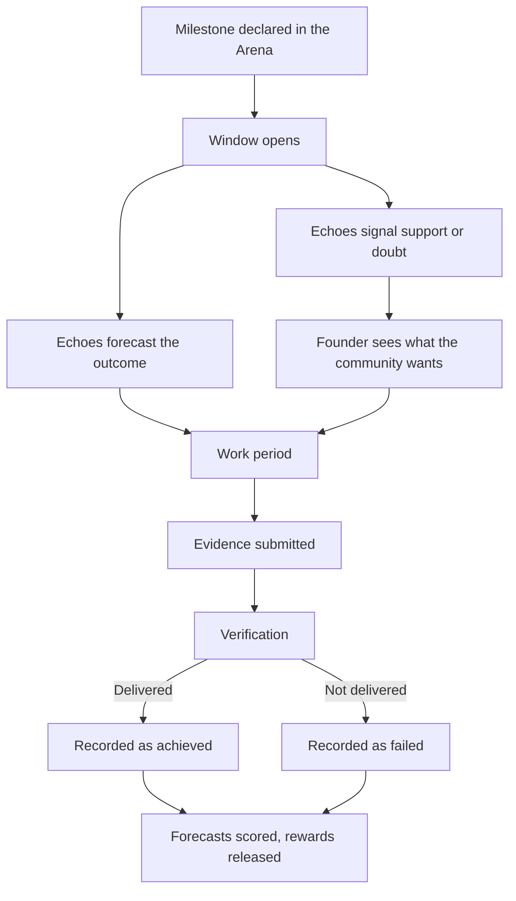

# Signals & Forecasts

## Two Free Ways to Take a Position

Studio3 gives the community two distinct ways to weigh in on a venture. Both are free. Neither
requires you to buy, hold, or risk anything.

- A **Signal** answers *"what do you think we should do?"*
- A **Forecast** answers *"what do you think will happen?"*

They look similar on the surface and they are not the same thing at all. Keeping them apart is
what stops Studio3 from collapsing into a popularity contest.

!!! important "There is no Studio3 token"
    Studio3 has no native token. You do not stake, buy, or burn anything to participate.
    Signalling and forecasting cost nothing.

## Signals

### What a Signal Is

A Signal is a preference. The venture asks the community a direct question and the community
answers it.

<h3>👍 Support</h3>

You think the venture should go ahead, or should take this option.

<ul>
<li>Free to cast</li>
<li>One tap</li>
<li>Visible to the founder immediately</li>
</ul>

<h3>👎 Doubt</h3>

You think the venture should not go ahead, or should take the other option.

<ul>
<li>Equally free, equally visible</li>
<li>Doubt is a contribution, not an attack</li>
<li>Founders are expected to answer it</li>
</ul>

Signal questions are usually shaped as yes/no or A-or-B:

- *Should we ship the mobile app before the web dashboard?*
- *Should this milestone be considered ambitious enough for the phase?*
- *Do you want us to open-source the SDK?*

### What a Signal Is Not

A Signal has no resolvable outcome. There is no later moment at which a preference turns out to
have been "right", so a Signal can never be scored, settled, or attached to money.

!!! warning "Signals are not predictions"
    If you find yourself asking "did my Signal win?", you are thinking of a Forecast. Signals do
    not win or lose. They tell the founder what the community wants.

## Forecasts

### What a Forecast Is

A Forecast is a probability you put on a question that will definitely be settled one way or the
other - usually whether a milestone will be delivered by its deadline.

<h3>🎯 How a Forecast Works</h3>

<ol>
<li>The venture declares a milestone with a clear, checkable outcome and a deadline.</li>
<li>The forecast question is written once, in resolvable form: <em>will this happen by then, yes or no?</em></li>
<li>You give your probability - say 70% - while the window is open.</li>
<li>The milestone is delivered or it is not, and verification records the answer.</li>
<li>Your forecast is scored against what actually happened and added to your personal accuracy record.</li>
</ol>

Forecasting is free. You are not putting anything at risk; you are putting your judgement on the
record, and the record is public.

### Why Accuracy Matters

Your accuracy record is the thing you actually build as an Echo. It is a track record of calls
made in public, before the outcome was known, on questions that were later settled.

- Confident and right counts for more than hedged and right.
- Confident and wrong counts against you.
- Sitting out a question you do not understand costs you nothing.

Accuracy is one of the inputs to the progression titles - novice, adept, expert, master, legend.
Those titles are earned from verified outcomes, forecast accuracy, and delivered bounties. They
cannot be bought, farmed, or accumulated by holding anything.

## Prediction Markets

### Optional, External, and Rare

For some milestones a **prediction market** may exist on **Polymarket**, an external platform
that Studio3 does not operate. Where one exists, and where the viewer is eligible to use it, a
forecast on that question can carry real money.

<h3>⚠️ What you should understand about markets</h3>

<ul>
<li><strong>They are optional.</strong> Each venture can switch markets on or off, and studios set a default.</li>
<li><strong>They are external.</strong> Trading happens on Polymarket, under Polymarket's rules, not Studio3's.</li>
<li><strong>They are unavailable in many places.</strong> Polymarket blocks trading from a long list of jurisdictions. If you are in one of them, you will not see a market.</li>
<li><strong>They are rare.</strong> Most milestones will never have one.</li>
<li><strong>Money only ever attaches to a Forecast</strong>, never to a Signal.</li>
</ul>

!!! info "The product is complete without markets"
    Free forecasting is the default and the plan. A market is an upgrade on the same question for
    the people who can access one - not the way Studio3 works. If no market exists, or you are
    not eligible for it, the forecast is still there and still counts towards your record.

## Where Signals and Forecasts Live

Both happen inside an **Arena** - the contest a venture opens around what it is trying to
achieve.

### The Milestone Cycle

1. **Declaration** - the founder declares a specific, checkable milestone with a deadline.
2. **Open window** - Echoes signal, forecast, and ask questions. Both are free.
3. **Execution** - the founder works. Progress updates are posted publicly.
4. **Evidence** - the founder submits evidence that the milestone was met.
5. **Verification** - Studio3 staff verify at launch; Anchors take this over as the platform matures.
6. **Settlement** - the outcome is recorded permanently, forecasts are scored, and any rewards held for the milestone are released.

!!! danger "Failure is public and permanent"
    If a milestone is not delivered, the record says so, and it stays saying so. Nothing is
    quietly retired. The permanence is the point: it is what makes a good track record worth
    having.

## Rewards

Rewards in Studio3 are real. They are **USDC**, plus non-cash items such as merch, access,
tickets, credits, and digital collectibles. They reach people through **Drops** and **Bounties**,
are held by the Arena, and are released on success.

Rewards are not paid out of a token supply and are not created by signalling. See
[Rewards & Consequences](rewards-system.md) for the full picture.

!!! note "Not yet live"
    Drops, Bounties, evidence submission, and Arena-held rewards are decided and described here as
    the model Studio3 is building towards. They are not features you can use today.

## Signalling Well

### For Echoes

!!! tip "Getting good at this"
    1. **Separate the two questions.** What you want to happen and what you think will happen are different answers. Give both honestly.

    2. **Research before you forecast.** Look at the founder's delivery history, the specificity of the milestone, and whether the team has what the work needs.

    3. **Calibrate.** If you say 90% you should be right about nine times in ten. Systematically overconfident forecasts show up in your record.

    4. **Say why.** Writing down your reasoning is how you find out later whether you were right for the right reason.

    5. **Skip what you do not understand.** There is no cost to sitting out, and no reward for volume.

### Common Mistakes

| Mistake | What it looks like | Better approach |
|---------|--------------------|-----------------|
| **Signalling your forecast** | Voting "no" because you expect failure | Signal what you want; forecast what you expect |
| **Following the crowd** | Copying the visible consensus | Form your view first, then look |
| **Confirmation bias** | Reading only what supports your call | Go looking for the strongest counter-argument |
| **Recency bias** | Judging on last week's update | Read the full delivery history |
| **Overconfidence** | Everything at 95% | Reserve extreme probabilities for extreme cases |

## Rights & Responsibilities

### Your Rights as an Echo

✅ You have the right to:

- Signal and forecast on any open milestone, for free
- Access all public information about the venture
- Change your view between milestones
- Build a public, portable accuracy record

### Your Responsibilities

⚠️ You must:

- Give your genuine view, not a coordinated one
- Not spread false information to move sentiment
- Not use non-public information
- Not operate multiple accounts
- Respect verification outcomes

### Prohibited

❌ Never:

- Coordinate signals in private groups
- Manufacture doubt to damage a venture you compete with
- Create fake accounts
- Attempt to influence a verifier improperly

## Ethics

!!! quote "The Signal Oath"
    "I signal what I believe we should do, and I forecast what I believe will happen, based on my
    own research. I neither follow blindly nor lead astray. My record is public and I stand behind
    it."

## FAQ

**Q: Does it cost anything to signal or forecast?**
A: No. Both are free, always.

**Q: Do I need a token or a wallet balance?**
A: No. Studio3 has no native token.

**Q: Can I change my forecast?**
A: While the window is open, yes. Each forecast is timestamped and scored on its own, and
committing earlier carries more weight on your record.

**Q: Can I signal on my own venture?**
A: No. Founders cannot signal or forecast on their own milestones.

**Q: What happens if a milestone is cancelled?**
A: The question is voided. Nothing is scored against your record.

**Q: Where does the money in a prediction market come from?**
A: From Polymarket's market, not from Studio3. Studio3 does not take positions and does not run
the market.

**Q: What if there is no market for a milestone I care about?**
A: That is the normal case. Forecast for free; it counts the same towards your record.

## Next Steps

- Explore the [Arena System](arena-system.md) to see where signals and forecasts happen
- Study the [Milestone System](milestones.md) to forecast better
- Read [Rewards & Consequences](rewards-system.md) for how rewards actually work
- Learn the [Three-NFT System](nft-system.md) for ownership mechanics
