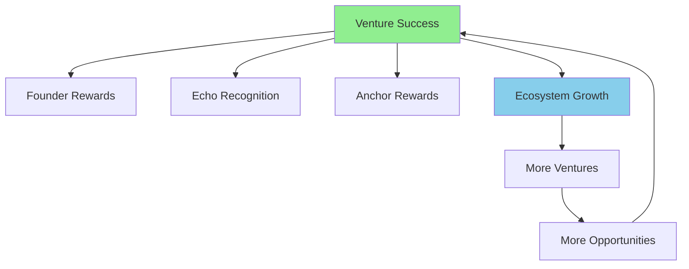
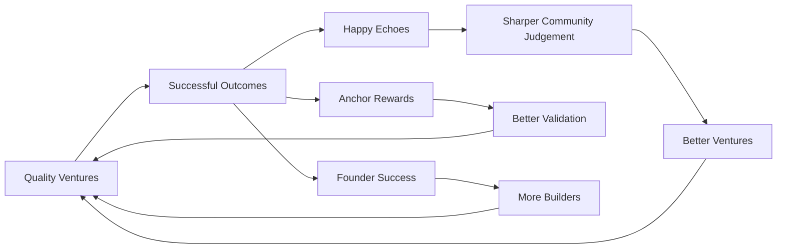
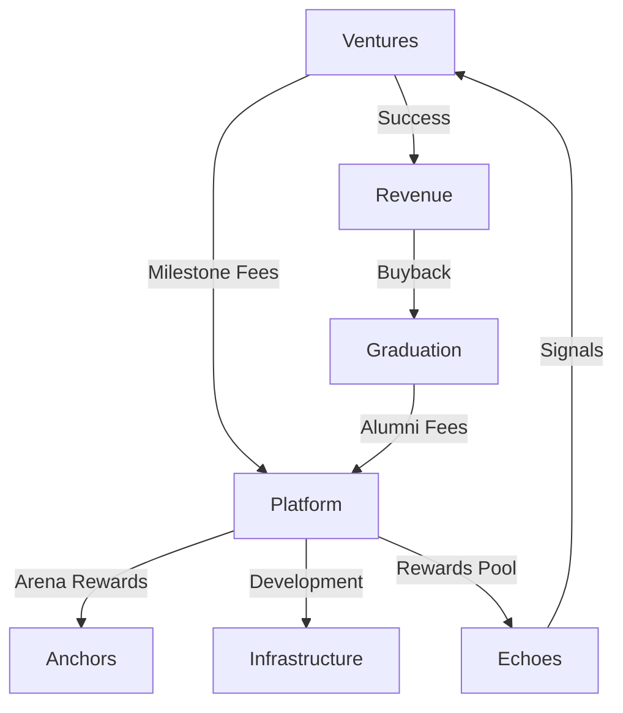

# Aligned Incentives

## Where Everyone Wins Together

Studio3's revolutionary design aligns the interests of all participants, creating a positive-sum ecosystem where individual success drives collective prosperity. This alignment is the secret sauce that makes the platform work.

## The Alignment Philosophy

### Breaking Traditional Misalignment

### 🔗 Traditional vs Studio3 Model

**Traditional Venture Ecosystem:**

- **VCs want huge returns, founders want control**
- Investors seek quick exits, builders need time
- Advisors give minimal time for maximum equity
- Community gets nothing despite creating value

** Studio3 Alignment:**

- **Everyone gains when a venture succeeds**
- Transparent milestones align timelines
- Active participation rewarded fairly
- Community captures value they create

### The Positive-Sum Game

## Incentive Structures

### For Senders (Founders)

### 🏗️ Founder Incentive Stack
** Short-term Incentives:**

- **💰 **Milestone Funding: Immediate resources for execution
- **📡 **Community Support: Belief signals provide validation
- **🎓 **Expert Guidance: Anchor mentorship accelerates growth
- **🏆 **Public Recognition: Arena success builds reputation

** Long-term Incentives:**

- **👑 **Full Ownership: Sovereignty through Ascension
- **🚀 **Unlimited Upside: No cap on venture value
- **🌐 **Network Effects: Alumni status opens doors
- **🏭 **Sub-Studio Rights: Launch your own ecosystem

** Behavioral Alignment:**

- **Transparency rewarded with more support**
- Consistent delivery builds belief momentum
- Community engagement multiplies resources
- Long-term thinking enables graduation

### For Echoes (Supporters)

### 📡 Echo Incentive Matrix
**What you get:**

| What you do | Costs | What it earns you |
|-------------|-------|-------------------|
| Signal support or doubt | Nothing | A say in what the venture does next |
| Forecast an outcome | Nothing | A public, scored accuracy record |
| Claim and deliver a bounty | Your work | A real reward, released by the Arena |
| Contribute to a venture that succeeds | Your work | A share of what the Arena holds |

** Indirect Benefits:**

- **🌟 **Reputation Growth: progression titles from verified outcomes and forecast accuracy
- **🤝 **Network Access: Connect with winners early
- **🎓 **Learning Opportunity: Understand venture building
- **🎯 **Influence Power: Shape venture direction

** Behavioral Incentives:**

- **Research rewarded over speculation**
- Calibration rewarded over volume
- Active engagement improves outcomes
- Consistency over time is what builds a title

### For Anchors (Validators)

### ⚓ Anchor Reward System
** How Anchors are rewarded:**

- **Real rewards**:
  USDC and non-cash items, released by the Arena
- **Against verified work**:
  Paid for verification and mentorship that actually happened
- **Rates and proportions**:
  Not yet set, and deliberately not described here

!!! note "Verification at launch"
    Studio3 staff verify milestones and bounties at launch. Anchors take verification over as the
    platform matures.

** Additional Incentives:**

- **🎆 **Success Participation: a share of what the Arena releases on ventures you helped
- **👥 **Network Premium: Access to top founders
- **🏅 **Status Recognition: Elite validator standing
- **🌱 **Ecosystem Impact: Shape quality standards

** Behavioral Alignment:**

- **Thorough validation rewarded over rushed**
- Mentorship improves venture success rates
- Fair judgments build long-term reputation
- Ecosystem health creates more opportunities

## Systemic Alignments

### The Virtuous Cycle

### Punishment Alignment

!!! warning "Negative Incentives Also Align"
    
    For Senders:
    
- **Failed milestones damage reputation permanently**
- Poor communication reduces future support

- Abandoned ventures blacklist founders
    
    For Echoes:
- **Wrong forecasts are recorded permanently against your accuracy**
- Herd following shows up as poor calibration

- Reputation reflects recent, verified activity
    
    For Anchors:
- **Poor validations reduce future assignments**
- Biased judgments trigger Council review

- Inactive Anchors lose status quickly

## Economic Alignments

### How the Economics Work

Studio3 has no native token, so none of this runs on supply, demand, or burns. It runs on real
rewards committed up front and released against verified results.

    

        <h4>💵 Real Rewards</h4>
        
USDC and non-cash items

        <ul>
            <li>Committed to the Arena before work starts</li>
            <li>Released on verified success</li>
            <li>Not released on failure</li>
        </ul>
    

    
    

        <h4>🔥 Permanent Record</h4>
        
Failure is public and stays public

        <ul>
            <li>Nothing is quietly retired</li>
            <li>A clean record is hard to get</li>
            <li>Which is what makes it worth having</li>
        </ul>
    

    
    

        <h4>🌀 Free Participation</h4>
        
No barrier to weighing in

        <ul>
            <li>Signals cost nothing</li>
            <li>Forecasts cost nothing</li>
            <li>Titles come from outcomes, not holdings</li>
        </ul>
    

### Revenue Flows

## Social Alignments

### Reputation as Currency

### 🌟 Reputation Without Points
**How Reputation Aligns Behavior:**

1. 

Cannot Be Bought

- **Only earned through performance**
2. **Cannot Be Transferred**
- Prevents gaming
3. **Decays Without Activity**
- Encourages participation
4. **Multiplies Opportunities**
- Success breeds success
- **Reputation Benefits: **

- **🎯 A title that reflects verified work**
- 🗿️ Governance voting weight
- 🎆 Priority access to opportunities
- 🤝 Trust in interactions

### Network Effect Alignment

!!! info "Everyone Benefits from Growth"

    - **More Senders** = More opportunities for Echoes More Echoes
    - = Better funding for Senders** More Anchors** - = Higher quality standards Higher Quality
- **- = Attracts more participants** Larger Network
- = Greater value for all

### Short vs Long Term

<h4>⏱️ Short-term Alignment</h4>

<strong>Immediate Rewards for Good Behavior</strong>

<ul>
<li>Fast feedback on your forecasts</li>

<li>Milestone funding</li>

<li>Rewards from the Arena</li>

<li>Bounties delivered and paid</li>

</ul>

    

<h4>📈 Long-term Alignment</h4>

<strong>Compound Benefits for Patience</strong>

<ul>
<li>Reputation accumulation</li>

<li>Network building</li>

<li>Venture graduation</li>

<li>Ecosystem ownership</li>

</ul>

### Phase-Based Incentives

| Phase | Sender Focus | Echo Focus | Anchor Focus |
|-------|--------------|------------|-------------|
| **Spark** | Gather support | Find opportunities | Scout talent |
| **Forge** | Win leadership | Pick winners | Judge fairly |
| **Ignition** | Build fast | Support early | Guide setup |
| **Drift** | Find PMF | Stay through the pivot | Navigate pivots |
| **Orbit** | Stable growth | Build accuracy record | Ensure quality |
| **Flare** | Scale rapidly | Track the scale-up | Maintain standards |
| **Ascension** | Achieve sovereignty | Mark the outcome | Celebrate success |

## Misalignment Safeguards

### Preventing Gaming

### 🚫 Anti-Gaming Mechanisms
**Prevented Behaviors:**

1. **Sybil Attacks** Reputation tied to single identity

- Titles require verified outcomes, which extra accounts cannot manufacture

- Network analysis detects clusters

2. **Collusion**

- **Public transparency**
- Random Anchor assignment

- Community oversight

3. **Hype cycles**

- **Long-term reputation effects**

- Rewards only release against verified delivery

- Failure stays on the record

4. **Information Asymmetry**

- **All updates public**
- Insider trading impossible

- Equal access to data

### Conflict Resolution

When incentives seem misaligned:

1. **Transparency First**
- Make all positions clear
2. **Find Common Ground**
- Shared success metrics
3. **Long-term View**
- Reputation matters more
4. **Community Decision**
- Let ecosystem decide
5. **Learn & Adjust**
- Evolve the system

### Continuous Improvement

### Continuous Improvement

** Behavior Monitoring:**

- **Track venture success rates**
- Measure Echo participation volume
- Assess Anchor validation quality
- Monitor ecosystem growth

** Parameter Adjustment:**

- **If venture quality drops**:
  Increase failure penalties
- If Echo participation lags: Make forecast questions clearer and windows longer
- If Anchor performance suffers: Enhance quality bonuses
- If growth slows: Introduce new incentives

** Feedback Loop:**

- **Analyze behavior patterns**
- Identify misalignments
- Propose adjustments
- Test and iterate

### Future Incentive Features

!!! tip "Planned Enhancements"

- **Conditional Signals**:
  "I think we should, if..."
- **Skill-Based Matching**:
  Connect compatible participants
- **Achievement Unlocks**:
  Gamified progression rewards
- **Cross-Venture Synergies**:
  Incentivize collaboration
- **Retroactive Rewards**:
  Surprise bonuses for excellence

## Success Metrics

### Measuring Alignment

| Metric | Target | Current | Health |
|--------|--------|---------|--------|
| **Venture Success Rate** | >40% | 38% | 🟡 Good |
| **Anchor Accuracy** | >85% | 89% | 🟢 Excellent |
| **Retention (1 year)** | >70% | 68% | 🟡 Good |
| **NPS Score** | >50 | 62 | 🟢 Excellent |

### Behavioral Indicators

    

        <h4>✅ Aligned Behaviors</h4>
        <ul>
            <li>Transparent communication</li>
            <li>Long-term thinking</li>
            <li>Collaborative problem solving</li>
            <li>Quality over quantity</li>
            <li>Ecosystem advocacy</li>
        </ul>
    

    
    

        <h4>❌ Misaligned Behaviors</h4>
        <ul>
            <li>Information hoarding</li>
            <li>Short-term extraction</li>
            <li>Zero-sum competition</li>
            <li>Gaming metrics</li>
            <li>Ecosystem exploitation</li>
        </ul>
    

## Case Studies

### Alignment in Action

#### 🌟 The DataMesh Success
**Situation:** Complex technical venture needing patient supporters- Alignment: Long-term Echoes matched with technical AnchorsResult:

18-month journey to profitability> "The aligned incentives meant our Echoes supported us through the hard times, because they had said in public they thought we would make it. Traditional VCs would have pushed for premature scaling." - DataMesh CTO

#### 💪 The QuickPivot Comeback

**Situation:** Failed first product, needed major pivot- Alignment: A permanent public failure record motivated honest assessmentResult:

Fast pivot, community retained, eventual success> "Having the failure sit there in public hurt, but it forced us to be honest about it. The quick pivot saved the venture and our supporters appreciated the transparency." - QuickPivot Founder

## Your Incentive Strategy

### Maximizing Your Alignment

- 1. Understand the System
- Know what behaviors are rewarded
2. **Play Long Games**
- Reputation compounds over time
3. **Create Value**
- Focus on positive-sum outcomes
4. **Build Relationships**
- Network effects multiply reach
5. **Stay Engaged**
- Active participation captures more value

- Review role-specific incentives in detailed guides
- Learn [Rewards & Consequences](rewards-system.md) specifics
- Read [Signals & Forecasts](belief-signals.md) for how the community weighs in