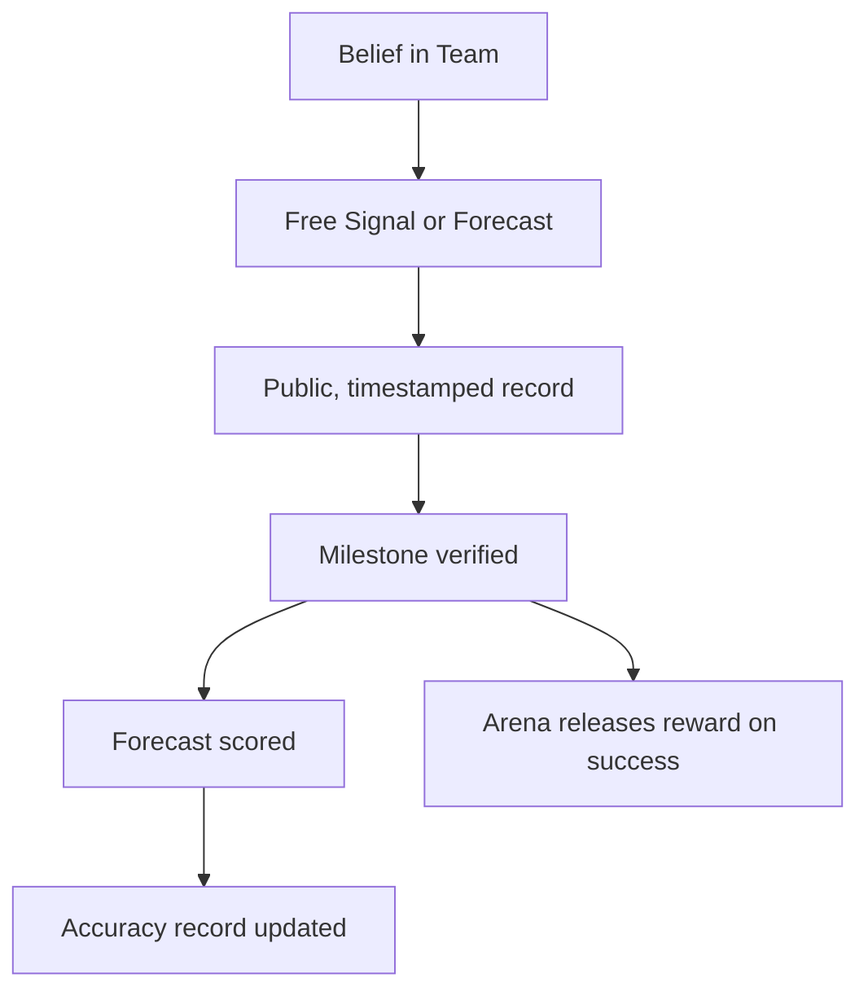
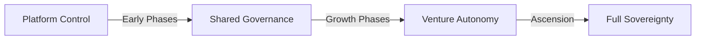

# Key Principles

## The Foundation of Studio3

Studio3 operates on revolutionary principles that transform how ventures are built, funded, and grown. These core tenets guide every aspect of our ecosystem.

## 1. Transparency as Default

### Everything Happens in Public

In traditional venture building, progress happens behind closed doors. Studio3 flips this model:

!!! quote "The Arena Principle"
    "In the Arena, there are no secrets - only execution."

- **All milestones** are declared publicly
- **All progress** is tracked transparently
- **All failures** are visible to everyone

- **All successes** are celebrated openly

This radical transparency creates:

- **Accountability** through public commitment
- **Trust** through verifiable progress
- **Learning** through shared experiences

- **Speed** through immediate feedback

## 2. Conviction on the Record

### Belief Costs Nothing and Still Counts

Studio3 has no token. Expressing belief is free - what makes it matter is that it is public,
timestamped, and later checked against what happened.

**Key aspects:**

- **Signalling and forecasting are free** - nothing is bought, staked, or burned
- **Your calls are public before the outcome is known**
- **Accuracy builds lasting reputation**
- **Mistakes have permanent consequences on the record**

## 3. Community Validation

### The Crowd Decides

No single authority determines success. Instead:

    

        <h4>🗳️ Signal Aggregation</h4>
        
Collective belief/doubt determines support levels

    

    

        <h4>⚓ Anchor Verification</h4>
        
Expert validators ensure quality standards

    

    

        <h4>📊 Market Dynamics</h4>
        
Real-time sentiment guides venture direction

    

## 4. Gamified Progression

### Seven Phases, Clear Rules

Venture building becomes a game with:

- **Defined stages** from Spark to Ascension
- **Clear objectives** for each phase
- **Measurable progress** through milestones

- **Tangible rewards** for achievement

- **Real penalties** for failure

!!! info "Game Mechanics"
    Unlike traditional "gamification," Studio3's game has real consequences. Rewards are real money and real goods, reputations are built or destroyed in public, and ventures live or die based on performance.

## 5. Aligned Incentives

### Everyone Wins Together

The ecosystem aligns all participants:

| Role | Wants | Gets | Gives |
|------|-------|------|-------|
| **Founders** | Funding & support | Resources & validation | Transparent execution |
| **Echoes** | A record worth having | Rewards and a public accuracy record | Honest judgement |
| **Anchors** | Quality ventures | Rewards from the Arena | Expert guidance and verification |
| **Ecosystem** | Sustainable growth | Successful ventures | Fair platform |

## 6. Permissionless Innovation

### Anyone Can Play

No gatekeepers, no applications, no committees:

- **Any idea** can become a Spark
- **Any founder** can enter the Forge
- **Any supporter** can signal belief

- **Any expert** can become an Anchor

!!! warning "With Freedom Comes Responsibility"
    Permissionless doesn't mean consequence-free. Bad actors are naturally filtered out by a permanent public record and reputation loss.

## 7. Progressive Decentralization

### From Central to Sovereign

Ventures gradually gain independence:

1. **Start** with platform support2. **Grow** with community governance3. **Mature** with increasing autonomy4. **Graduate** to full sovereignty## 8. Failure as Feature

### Learning Through Loss

Failure isn't hidden or minimized:

- **Failed milestones** are recorded permanently, and the reward is not released
- **Failed ventures** become case studies
- **Failed forecasts** damage your accuracy record

- **Failed strategies** inform future attempts

!!! quote "The Failure Principle"
    "In Studio3, failure is costly but educational. Every recorded failure teaches the ecosystem what doesn't work."

## 9. Compound Reputation

### Trust Builds Over Time

Reputation in Studio3 is a track record, not a points balance. Progression titles - novice, adept,
expert, master, legend - are earned from verified outcomes, forecast accuracy, and delivered
bounties. Your reputation:

- **Cannot be bought**
- only earned
- **Cannot be transferred**
- tied to identity
- **Cannot be gamed**
- based on results
- **Compounds over time**
- early success matters

## 10. Recursive Growth

### Success Creates Success

The ecosystem is designed for exponential growth:

1. **Successful ventures** graduate to sovereignty2. **Sovereign ventures** can launch sub-studios3. **Sub-studios** follow the same principles4. **Network effects** compound across levels## Living These Principles

### Daily Practice

These aren't just ideas - they're daily practices:

!!! tip "For Founders"

- Declare milestones publicly

- Share progress openly

- Accept community feedback

- Build in the Arena

!!! tip "For Supporters"

- Signal and forecast honestly - both are free

- Accept the risk of being wrong in public

- Learn from failures

- Celebrate successes

!!! tip "For Validators"

- Maintain high standards

- Provide honest feedback

- Guide without controlling

- Protect ecosystem integrity

## The Principles in Action

### Real Examples

<h4>🌟 Case Study: OpenHealth Venture</h4>

<strong>Principle Applied:</strong>

<strong>Radical Transparency</strong>

When OpenHealth hit technical challenges in Phase 3, they shared their struggles publicly. The community rallied with technical support, and they pivoted successfully.

<strong>Result:</strong>

<strong>Stronger product, loyal community, successful graduation</strong>

<h4>💥 Case Study: QuickFlip Failure</h4>

<strong>Principle Applied:</strong>

<strong>Failure as Feature</strong>

QuickFlip consistently missed milestones. Every miss stayed on the public record, and their detailed post-mortem became required reading for new founders.

<strong>Result:</strong>

<strong>Expensive lesson that improved ecosystem quality</strong>

## Principles vs. Practice

### Common Misconceptions

| Misconception | Reality |
|---------------|------|
| "It's just gambling" | Signals represent conviction about execution ability |
| "Transparency is optional" | Public execution is mandatory |
| "Reputation can be bought" | Titles only come from verified outcomes and accurate forecasts |
| "Failure is shameful" | Failure is expensive but valuable |

## Evolution of Principles

### Continuous Refinement

These principles evolve through:

- **Community feedback** shapes interpretation
- **Edge cases** refine implementation
- **Success patterns** inform best practices

- **Failure modes** highlight necessary adjustments

!!! info "Living Document"
    These principles are living guidelines, not rigid rules. They evolve as the ecosystem learns and grows.

## Next Steps

### Applying the Principles

1. **Understand** how principles guide decisions2. **Observe** them in action in the Arena3. **Practice** applying them to your role4. **Share** experiences with the community## Related Reading

- Dive into [The Arena System](arena-system.md) to see principles in practice
- Explore [Belief & Doubt Signals](belief-signals.md) for conviction mechanics
- Learn about [Three-NFT System](nft-system.md) for ownership principles
- Understand [Seven Phase Lifecycle](seven-phases.md) for progression principles