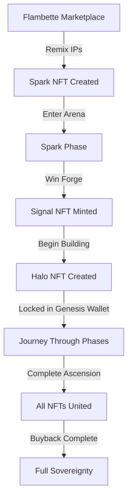
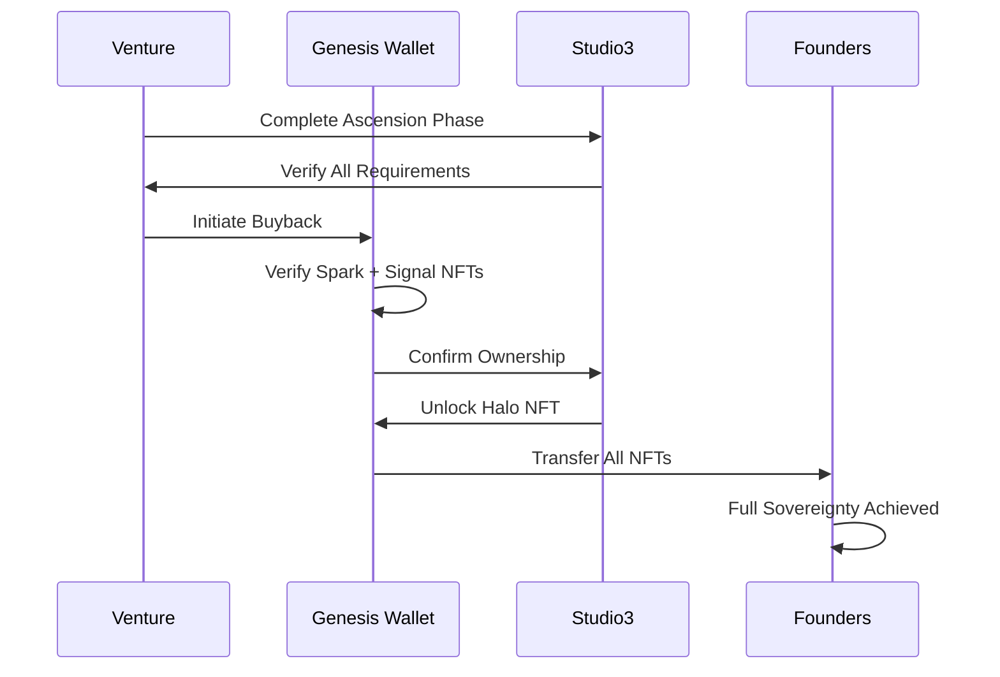
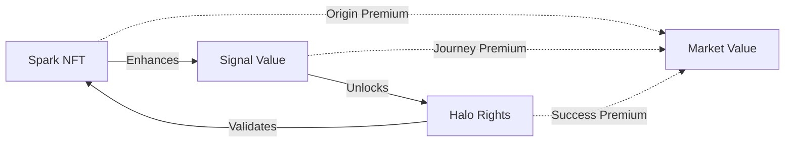

# The Three-NFT System

## Digital Assets That Tell a Story

Studio3's innovative three-NFT system creates a complete narrative arc for every venture, from initial spark of inspiration to full sovereignty. Each NFT serves a unique purpose in the venture's journey.

## The Three NFTs

### Overview

<div class="grid cards">
<div class="arena-card">

<h3>🎨 Spark NFT</h3>
<p><strong>The Origin</strong></p>

<p>Represents the original idea and IP combination</p>


<ul>
<li>Created from Flambette marketplace</li>


<li>Contains remixed IP metadata</li>


<li>Tradeable and collectible</li>


<li>Required for Forge entry</li>

</ul>
</div>

<div class="arena-card">

<h3>📡 Signal NFT</h3>
<p><strong>The Journey</strong></p>

<p>Dynamic NFT tracking the venture's entire lifecycle</p>


<ul>
<li>Awarded to Forge winner</li>


<li>Updates with each milestone</li>


<li>Records all signals received</li>


<li>Becomes more valuable over time</li>

</ul>
</div>

<div class="arena-card">

<h3>🛡️ Halo NFT</h3>
<p><strong>The Achievement</strong></p>

<p>Soulbound proof of successful graduation</p>


<ul>
<li>Created at venture inception</li>


<li>Locked until Ascension</li>

<li>Non</li>
<li>transferable honor</li>


<li>Unlocks sovereign rights</li>

</ul>
</div>
</div>

## NFT Lifecycle

### The Complete Journey



## Spark NFT

### The Beginning of Everything

!!! info "Spark NFT Details"

    **Purpose:** The genesis of every venture

    **Creation:** Remix IP-NFTs on Flambette

    **Utility:** Entry ticket to Studio3 Arena

    **Trading:** Free market on OpenSea

### Creation Process

1. **Browse Flambette**
   - Explore available IP-NFTs
2. **Select Components**
- Choose 2-5 IPs to combine
3. **Define Synthesis**
- Explain how they connect
4. **Mint Spark**
- Pay minting fee, receive NFT
5. **Enter Arena**
- Use Spark to launch venture

```text
Example Spark NFT Information:

• Name: DeFi Health Records Spark
• Description: Combining blockchain medical records with DeFi lending
• Remixed IPs: 
  - Medical records patent (stored on IPFS)
  - DeFi protocol framework (stored on IPFS)
• Synthesis Concept: Enable medical history-based credit scoring
• Creator: Wallet address of the person who minted this Spark
• Creation Date: March 15, 2024 at 10:30 AM
• Unique Spark ID: SPARK-2024-0342
```

### Spark Value Factors

| Factor | Impact on Value |
|--------|----------------|
| **IP Quality** | Higher quality sources = higher value |
| **Synthesis Novelty** | Unique combinations command premiums |
| **Market Timing** | Hot sectors increase demand |
| **Creator Reputation** | Proven creators' Sparks valued higher |
| **Historical Performance** | Sparks that led to successful ventures |

## Signal NFT

### The Living Chronicle

!!! info "Signal NFT Details"

    **Purpose:** Tracks venture progress dynamically

    **Creation:** Awarded to Forge duel winners

    **Utility:** Identity and progress tracker

    **Updates:** Real-time milestone status

### Dynamic Properties

<div class="arena-card">

<h3>🎨 Visual Evolution</h3>


<p>The Signal NFT's appearance changes based on:</p>
<ul>
<li><strong>Phase Progress:</strong></li>

</ul>
<p><strong>Color shifts with each phase</strong></p>

<ul>
<li><strong>Signal Strength:</strong></li>

</ul>
<p><strong>Brightness indicates support</strong></p>
<ul>
<li><strong>Milestone Success:</strong></li>

</ul>
<p><strong>New elements appear</strong></p>
<ul>
<li><strong>Community Size:</strong></li>

</ul>
<p><strong>Complexity increases</strong></p>
<ul>
<li><strong>Time Active:</strong></li>

</ul>
<p><strong>Aged patina develops</strong></p>

</div>

### Signal NFT Metadata Structure

```text
Example Signal NFT Data:

Venture Identity:
• Name: MediLend Protocol Signal
• Current Phase: Orbit (stable operations phase)

Performance Statistics:
• Milestones Completed: 8 successful milestones
• Milestones Failed: 1 failed milestone
• Total Signals Received: 12,400 signals across all milestones
• Belief Ratio: 73% of signals are positive (belief)
• Supporter Count: 1,847 active community members
• Days Active: 234 days since venture launch

Visual Appearance:
• Base Color: Bright blue (#4A90E2)
• Glow Intensity: 80% brightness level
• Pattern Complexity: Level 7 (highly detailed)
• Special Effects: 
  - Phase transition animation
  - Milestone sparkle effect

Achievements Unlocked:
• First Pivot Success - Successfully changed direction
• Community Choice Award - Voted favorite by supporters
• Anchor Excellence - Top validation scores
```

### Signal NFT Utility

| Utility | Description |
|---------|-------------|
| **Governance Weight** | Vote power in Container DAO decisions |
| **Revenue Share** | Claim on protocol revenues |
| **Access Rights** | Entry to founder-only resources |
| **Network Benefits** | Priority access to partners |
| **Historical Record** | Immutable proof of journey |

## Halo NFT

### The Ultimate Achievement

!!! info "Halo NFT Details"

    **Purpose:** Proof of venture sovereignty

    **Creation:** Minted at container DAO formation

    **Utility:** Unlocks full ownership rights

    **Transfer:** Soulbound until buyback

### Sovereignty Rights

The Halo NFT unlocks:

<div class="grid cards">
    <div class="card">
        <h4>🏛️ Full Control</h4>
        <p>Complete ownership of all venture assets</p>
    </div>
    <div class="card">
        <h4>🚀 Launch Rights</h4>
        <p>Ability to create sub-studios</p>
    </div>
    <div class="card">
        <h4>👑 Alumni Status</h4>
        <p>Permanent recognition in ecosystem</p>
    </div>
    <div class="card">
        <h4>🌐 Network Access</h4>
        <p>Lifetime Studio3 graduate benefits</p>
    </div>
</div>

### Halo Activation Process



## The Genesis Wallet

### Sacred Vault of Venture Identity

!!! important "Genesis Wallet Mechanics"
    The Genesis Wallet is a multisig smart contract that holds all three NFTs during the venture's journey. It ensures no single party can compromise the venture's digital identity.

### Multisig Structure

| Phase | Signers | Threshold |
|-------|---------|----------|
| **Ignition-Drift** | 2 Founders + 1 Anchor + 2 Studio3 | 3 of 5 |
| **Orbit** | 3 Founders + 1 Anchor + 1 Studio3 | 3 of 5 |
| **Flare** | 4 Founders + 1 Studio3 | 3 of 5 |
| **Ascension** | 5 Founders | 3 of 5 |

## NFT Interactions

### How They Work Together

<div class="arena-card">

<h3>🔗 The Trinity Effect</h3>
<p><strong> When all three NFTs are united in one wallet:</strong></p>
<ul>
<li>🎨 <strong>Spark</strong> provides the origin story</li>

<li>📡 <strong>Signal</strong> shows the journey</li>

<li>🛡️ <strong>Halo</strong> proves the achievement<strong>Result:</strong></li>

</ul>
<p><strong>Complete sovereignty over the venture's future</strong></p>

</div>

### Cross-NFT Benefits



## NFT Economics

### Value Drivers

| NFT Type | Primary Value | Secondary Value |
|----------|---------------|----------------|
| **Spark** | IP combination quality | Historical significance |
| **Signal** | Venture performance | Community size |
| **Halo** | Sovereignty rights | Alumni network |

### Market Dynamics

!!! tip "Trading Strategies"

- **Spark Trading**:
  Buy promising ideas early
- **Signal Watching**:
  Track rising ventures
- **Halo Hunting**:
  Identify near-graduation ventures
- **Trinity Collecting**:
  Acquire complete sets## Technical Implementation

### Smart Contract Architecture

```text
NFT Smart Contract Functions:

Spark NFT Capabilities:
• Mint from IPs: Create new Spark NFTs by combining existing IP-NFTs
• Get Remix History: View which IP-NFTs were combined to create this Spark

Signal NFT Capabilities:
• Update Milestone: Record when milestones succeed or fail
• Add Signals: Track the total belief/doubt signals received
• Get Venture Stats: Retrieve complete performance data for the venture

Halo NFT Capabilities:
• Lock: Secure the Halo NFT in the Genesis Wallet during the journey
• Unlock: Release the Halo NFT when sovereignty is achieved
• Check Sovereignty: Verify if the venture has achieved full independence
```

### Metadata Standards

All NFTs follow extended ERC-721 with:

- On-chain core properties
- IPFS metadata for rich content
- Upgradeable visual renderers
- Cross-chain bridge compatibility

## Future Developments

### Planned Enhancements

<div class="grid cards">
    <div class="card">
        <h4>🌌 Interoperability</h4>
        <p>Cross-chain NFT bridges for wider access</p>
    </div>
    <div class="card">
        <h4>🎮 Gamification</h4>
        <p>Achievement badges and special traits</p>
    </div>
    <div class="card">
        <h4>🤝 Composability</h4>
        <p>NFTs as building blocks for new ventures</p>
    </div>
    <div class="card">
        <h4>🎥 Rich Media</h4>
        <p>Video and interactive NFT experiences</p>
    </div>
</div>

## Common Questions

### NFT FAQ

**Q: Can I sell my Signal NFT during the journey?**A: Yes, but it transfers all governance rights and future claims.

**Q: What happens to NFTs if a venture fails?**A: Spark remains tradeable, Signal stops updating, Halo stays locked.

**Q: Can multiple Sparks be combined?**A: Not directly, but you can reference multiple Sparks in proposals.

**Q: Are NFTs required to participate as an Echo?**A: No, only Founders need NFTs. Echoes need nothing but an account - signalling and forecasting are free.

**Q: Can NFTs be used as collateral?**A: Some DeFi protocols accept Spark and Signal NFTs as collateral.

## Success Stories

### Notable NFT Journeys

<div class="arena-card">

<h4>🌟 The First Trinity</h4>
<p><strong>Venture:</strong></p>

<p><strong>DecentralHealth</strong></p>

<p><strong>Journey:</strong> 18 months from Spark to Sovereignty</p>

<p><strong>Current Value:</strong></p>

<p><strong>Spark (50 ETH), Signal (200 ETH), Halo (Priceless)</strong></p>

<blockquote>"Watching our Signal NFT evolve with each milestone was magical. When we finally unlocked our Halo, it felt like graduation day." - DecentralHealth Founder</blockquote>

</div>

## Getting Started

### Your NFT Journey

1. **As a Creator**: Start on Flambette, mint your Spark
2. **As a Founder**: Win the Forge, earn your Signal
3. **As a Collector**: Trade Sparks, watch Signals
4. **As a Builder**: Work toward your Halo

- Explore [Seven Phase Lifecycle](seven-phases.md) to understand the journey
- Learn about [The Arena System](arena-system.md) where NFTs are earned
- Study [Container DAO Setup](../senders-guide/container-dao.md) for governance
- Visit Flambette marketplace to browse IP-NFTs