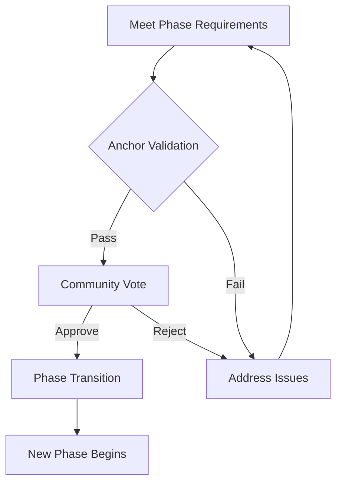
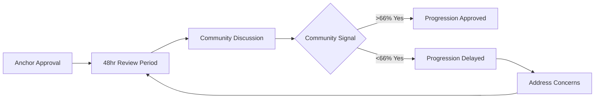
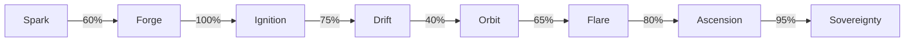

# Progression Rules

## The Laws of Venture Evolution

Progression through Studio3's seven phases follows clear rules designed to ensure sustainable growth while maintaining ecosystem integrity. These rules create a fair, transparent system where success is earned, not given.

## Core Progression Principles

### Fundamental Rules

<div class="arena-card">

<h3>📏 The Five Laws</h3>

<ul>
<li>1. <strong>Sequential Progress</strong></li>
<li>Phases must be completed in order</li>
</ul>
<p>2. <strong>No Skipping</strong></p>
<ul>
<li>Every venture experiences every phase</li>
</ul>
<p>3. <strong>Merit-Based</strong></p>
<ul>
<li>Advancement requires proven achievement</li>
</ul>
<p>4. <strong>Community Validated</strong></p>
<ul>
<li>Progress confirmed by ecosystem</li>
</ul>
<p>5. <strong>Time Bounded</strong></p>
</div>

### The Progression Framework



## Phase Requirements

### Universal Requirements

All phase transitions require:

!!! info "Base Requirements"
    - ✅ Complete all declared milestones (or approved pivots)
    - 📡 Maintain >60% belief ratio throughout phase
    - ⚓ Pass Anchor validation assessment
    - 🕒 Meet minimum phase duration
    - 📊 Achieve phase-specific metrics

### Phase-Specific Requirements

<div class="grid cards">
<div class="arena-card">

<h4>✨ Spark → Forge</h4>

<ul>
<li>A threshold of community support</li>

<li>10+ unique supporters</li>

<li>Clear problem</li>
<li>solution fit</li>


<li>Feasible execution plan</li>

<li>7</li>
<li>day minimum duration</li>

</ul>
</div>
    
<div class="arena-card">

<h4>⚔️ Forge → Ignition</h4>

<ul>
<li>Win founder duel</li>

<li>Claim Signal NFT</li>


<li>Win the Forge duel</li>


<li>Present winning vision</li>


<li>Automatic upon victory</li>

</ul>
</div>
    
<div class="arena-card">

<h4>🚀 Ignition → Drift</h4>

<ul>
<li>Container DAO formed</li>

<li>Core team assembled (3+)</li>


<li>MVP launched publicly</li>


<li>Initial users onboarded</li>

<li>14</li>
<li>day minimum</li>

</ul>
</div>
    
<div class="arena-card">

<h4>🌊 Drift → Orbit</h4>
<ul>
<li>Product</li>
<li>market fit signals</li>
<li>40%+ user retention</li>


<li>Sustainable unit economics</li>


<li>Clear growth trajectory</li>

<li>60</li>
<li>day minimum</li>

</ul>
</div>
    
<div class="arena-card">

<h4>🛸 Orbit → Flare</h4>

<ul>
<li>6 months stable operations</li>

<li>80%+ milestone success rate</li>


<li>Revenue/usage growing 10%+ monthly</li>


<li>External funding interest</li>

<li>180</li>
<li>day minimum</li>

</ul>
</div>
    
<div class="arena-card">

<h4>🔥 Flare → Ascension</h4>

<ul>
<li>Funding secured</li>

<li>20+ team members</li>


<li>Market leadership position</li>


<li>Buyback funds available</li>

<li>180</li>
<li>day minimum</li>

</ul>
</div>
</div>

## Validation Process

### Anchor Assessment

<div class="arena-card">

<h3>⚓ Validation Framework</h3>

<p><strong>Anchors evaluate:</strong></p>

<p>1. <strong>Milestone Completion</strong> (40%) All declared goals achieved?</p>

<ul>
<li>Evidence properly documented?</li>

<li>Quality meets standards?</li>

</ul>
<p>2. <strong>Community Health</strong> (30%) - Supporter engagement level</p>

<ul>
<li>Belief/doubt ratio</li>

<li>Communication quality</li>

</ul>
<p>3. <strong>Operational Excellence</strong> (20%) - Team performance</p>

<ul>
<li>Resource management</li>

<li>Process maturity</li>

</ul>
<p>4. <strong>Strategic Position</strong> (10%) - Market opportunity</p>

<ul>
<li>Competitive advantage</li>

<li>Growth potential</li>

</ul>
<p><strong>Minimum score: 70% to proceed</strong></p>
</div>

### Community Confirmation

After Anchor approval:



## Time Boundaries

### Duration Requirements

| Phase | Minimum | Target | Maximum | Extensions |
|-------|---------|--------|---------|------------|
| **Spark** | 7 days | 14 days | 30 days | Not allowed |
| **Forge** | 3 days | 5 days | 7 days | Not allowed |
| **Ignition** | 14 days | 30 days | 60 days | 1x30 days |
| **Drift** | 60 days | 120 days | 365 days | 2x60 days |
| **Orbit** | 180 days | 365 days | No max | Unlimited |
| **Flare** | 180 days | 365 days | No max | Unlimited |
| **Ascension** | 30 days | 60 days | 180 days | 1x60 days |

### Extension Mechanics

!!! warning "Extension Rules"

- Request before phase maximum reached

- Provide compelling justification

- Maintain >50% community support

- Anchor approval required

- Only one extension per phase (except Orbit/Flare)

## Performance Metrics

### Success Indicators

<div class="grid cards">
    <div class="card">
        <h4>📊 Quantitative Metrics</h4>
        <ul>
            <li>Milestone completion rate</li>
            <li>Revenue/user growth</li>
            <li>Signal and forecast volume</li>
            <li>Team expansion rate</li>
            <li>Funding secured</li>
        </ul>
    </div>
    
    <div class="card">
        <h4>🌟 Qualitative Metrics</h4>
        <ul>
            <li>Community sentiment</li>
            <li>Product quality</li>
            <li>Team cohesion</li>
            <li>Market position</li>
            <li>Innovation level</li>
        </ul>
    </div>
</div>

### Phase Health Scoring

```text
Phase Health Score Calculation:

The system calculates a venture's readiness for progression on a 0-100 scale:

Score Components:
• Milestone Completion: 40% of total score
  - Based on successful milestone completion rate
• Community Support: 30% of total score  
  - Measured by belief vs doubt signal ratio
• Operational Excellence: 20% of total score
  - Team efficiency and process maturity
• Growth Metrics: 10% of total score
  - Revenue, users, or other KPI growth

Special Modifiers:
• Drift Phase Pivot: -10% penalty if venture has pivoted
• Orbit Phase Consistency: +10% bonus for consistent delivery
• Final Score: Capped at maximum 100 points
• Minimum Required: 70 points to progress to next phase
```

## Special Circumstances

### Accelerated Progression

<div class="arena-card">

<h3>⚡ Fast Track Qualification</h3>

<p><strong>Exceptional ventures may progress faster if:</strong></p>

<ul>
<li><strong>Exceed all metrics by 200%+</strong></li>
<li>Unanimous Anchor approval</li>
<li>90%+ community support</li>
<li>Demonstrated exceptional execution</li>
<li>Strategic opportunity requires speed</li>

</ul>
<p><strong> Fast Track Limits:</strong></p>
<ul>
<li><strong>Minimum durations still apply</strong></li>
<li>Cannot skip phases</li>
<li>Extra scrutiny on validation</li>
<li>Higher evidence standards</li>

</ul>
</div>

### Regression Scenarios

!!! danger "When Ventures Move Backward"
    
    Regression only allowed during Drift phase:
    
    - **Failed product-market fit**

- Major pivot required

- Team reformation needed
    
    Regression Process:

    1. Founder requests regression
    2. Anchors assess situation
    3. Community votes on allowing
    4. Return to Ignition if approved
    5. Reputation penalty applied

### Stalled Progressions

When ventures can't advance:

| Scenario | Options | Consequences |
|----------|---------|-------------|
| **Missing Requirements** | Extension or remediation | Delayed progression |
| **Failed Validation** | Address issues and retry | Reputation impact |
| **Lost Community Support** | Rebuild confidence | Potential dissolution |
| **Resource Depletion** | Seek emergency funding | May force pivot |
| **Team Collapse** | Recruit replacements | Major delays |

## Progression Strategies

### For Founders

<div class="grid cards">
    <div class="card">
        <h4>🎯 Planning Ahead</h4>
        <p>Know next phase requirements from day one</p>
        <ul>
            <li>Study successful transitions</li>
            <li>Build buffer time</li>
            <li>Over-deliver on metrics</li>
            <li>Document everything</li>
        </ul>
    </div>
    
    <div class="card">
        <h4>🤝 Community First</h4>
        <p>Progression requires ecosystem support</p>
        <ul>
            <li>Communicate constantly</li>
            <li>Address concerns early</li>
            <li>Build believer base</li>
            <li>Engage doubters respectfully</li>
        </ul>
    </div>
</div>

### For Echoes

!!! tip "Supporting Smart Progression"

- **Signal strategically**
- on transition milestones Provide feedback

- during phase reviews** Support extensions**
- when justified Challenge rushers
- **- who aren't ready** Reward consistency
- over speed

### Complex Scenarios

<div class="arena-card">

<h3>🤔 What If...</h3>

<p><strong>Q: Venture succeeds wildly but hasn't met time minimum?</strong>A: Must wait. Time requirements ensure proper foundation.</p>

<p><strong>Q: All requirements met but Anchors see red flags?</strong>A: Anchors can require additional evidence or delays.</p>

<p><strong>Q: Community loves venture but metrics are weak?</strong>A: Objective metrics must be met. Sentiment alone insufficient.</p>

<p><strong>Q: External event disrupts progress (pandemic, war)?</strong>A: Force majeure provisions allow special extensions.</p>

<p><strong>Q: Founders want to stay in current phase longer?</strong>A: Allowed in Orbit/Flare. Other phases have maximums.</p>

</div>

## Historical Progression Data

### Success Rates by Transition



### Average Duration by Phase

| Phase | Average | Fastest | Slowest |
|-------|---------|---------|----------|
| **Spark** | 12 days | 7 days | 30 days |
| **Forge** | 4 days | 3 days | 7 days |
| **Ignition** | 28 days | 14 days | 58 days |
| **Drift** | 142 days | 64 days | 361 days |
| **Orbit** | 287 days | 182 days | 548 days |
| **Flare** | 394 days | 186 days | 892 days |
| **Ascension** | 47 days | 31 days | 176 days |

## Common Mistakes

### Progression Pitfalls

!!! danger "Avoid These Errors"

- **Rushing progression**
- Meeting minimums isn't enough

- **Ignoring community**
- Support can evaporate quickly

- **Weak documentation**
- Evidence must be bulletproof

- **Surprise pivots**
- Changes need community buy-in

- **Burning bridges**
- Failed progressions damage reputation

## Appeals Process

### Challenging Decisions

If progression is denied:

1. **Review Feedback**
- Understand specific issues
2. **Prepare Appeal**
- Address each concern
3. **Submit to Council**
- Anchor Council reviews
4. **Community Input**
- Public comment period
5. **Final Decision**
- Binding determination**!!! info "Appeal Success Rate: 23%"**
    Most denials are upheld. Better to address issues than appeal.

## Your Progression Path

### Planning Your Journey

- 1. Map Requirements
- Know every phase's needs
2. **Build Buffers**
- Plan for delays
3. **Track Metrics**
- Monitor continuously
4. **Engage Community**
- Maintain support
5. **Document Progress**
- Evidence from day one

- Study [Seven Phase Lifecycle](seven-phases.md) in detail
- Review [Milestone System](milestones.md) for execution
- Learn [Validation Framework](../anchors-guide/validation-framework.md)
- Explore phase-specific guides in [Senders Guide](../senders-guide/index.md)