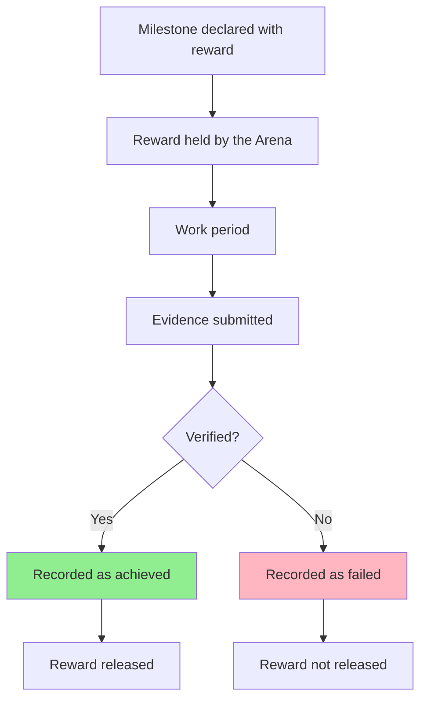

# Rewards & Consequences

## Real Rewards, Real Consequences

Studio3 rewards people with things that have value outside Studio3, and it records failure
permanently. There is no native token, no points economy, and nothing to stake.

!!! note "Described here as the model, not as a shipped feature"
    Drops, Bounties, evidence submission, and Arena-held rewards are settled decisions about how
    Studio3 works. They are being built. This page describes the model, not a screen you can open
    today.

## What a Reward Is

<h3>💵 USDC</h3>

Real money, in a stablecoin.

<ul>
<li>Attached to a specific milestone or piece of work</li>
<li>Held by the Arena until the outcome is settled</li>
<li>Released on success</li>
</ul>

<h3>🎁 Non-cash items</h3>

Things that are not money but are still worth having.

<ul>
<li>Merch</li>
<li>Access and invitations</li>
<li>Event tickets</li>
<li>Credits</li>
<li>Digital collectibles</li>
</ul>

Rewards are not minted, not inflationary, and not created by participating. A venture, a studio,
or a sponsor puts something real into an Arena, and the Arena releases it when the objective is
met.

## How Rewards Reach People

### Drops

A **Drop** is a reward granted to participants around a venture - recognising contribution,
early support, or presence at a moment that mattered. Drops can be USDC or non-cash items.

### Bounties

A **Bounty** is a specific piece of work, posted with a reward attached. Someone claims it,
delivers it, the delivery is verified, and the reward is released. Delivered bounties are part of
your public record.

### The Arena Holds It

The reward for a milestone is held by the **Arena** and released on success. That is what makes
the promise credible: the money is committed before the work starts, not promised afterwards.

!!! info "Deliberately not described here"
    How custody of those funds is arranged, and exactly how a reward is divided between multiple
    contributors, are not settled yet. Rather than guess, this guide says only what is decided:
    the Arena holds the reward, and releases it on success.

## Verification

Nothing is released until the outcome is verified.

- **At launch**, Studio3 staff verify milestone completion and bounty delivery.
- **Later**, Anchors take over verification as the platform matures.

The founder submits evidence. The verifier checks it against what was declared. The result is
recorded either way.

## Consequences

### Failure Is Public and Permanent

This is the hard edge of Studio3, and it is deliberate.

<h3>🔥 When a milestone fails</h3>

<ul>
<li>The reward is <strong>not</strong> released.</li>
<li>The failure is written into the venture's public record.</li>
<li>It stays there. It is not archived, softened, or quietly removed.</li>
<li>Forecasts that said it would succeed are scored as wrong.</li>
<li>The next milestone is read by the community in the light of this one.</li>
</ul>

!!! danger "No quiet retirement"
    A venture cannot delete a failed milestone and try again as though nothing happened. The
    permanence is what makes a clean record worth something.

### For Senders

Failing a milestone does not end a venture. Ventures are expected to miss sometimes - that is
what the Drift phase exists for. What failure costs is trust, and trust is rebuilt the same way
it was built: by declaring something specific and delivering it.

What failure does **not** cost is anything you staked, because you staked nothing.

### For Echoes

A wrong forecast costs you nothing but accuracy. It is recorded, it moves your accuracy number,
and it is visible. Being wrong in public is the price of having a record worth reading.

Signals are not scored at all. A Signal is a preference, and preferences do not turn out to be
wrong.

### For Anchors

Anchors are accountable for the quality of their verification. Verification that is later
overturned is a serious matter and affects an Anchor's standing and future assignments. The
specific consequences are set by the Anchor programme rather than by any automatic formula.

### Conduct

Separately from outcomes, some behaviour removes you from the platform:

| Behaviour | Consequence |
|-----------|-------------|
| **Coordinated or manipulated signalling** | Account suspension |
| **Falsified evidence** | Venture review, possible dissolution |
| **Multiple accounts** | Permanent ban |
| **Improper influence on a verifier** | Permanent ban |

## Recognition

Alongside rewards, Studio3 tracks **progression titles**: novice, adept, expert, master, legend.

They are earned from:

- **Verified outcomes** - milestones and bounties actually delivered
- **Forecast accuracy** - calls made in public before the answer was known
- **Delivered bounties** - work claimed and completed

They are **not** earned from points, staking, holdings, activity volume, or time served. There is
nothing to accumulate and nothing to buy. If you have not done verified work or made accurate
public calls, you do not move up.

## Why This Shape

<h3>⚖️ The logic</h3>

<ul>
<li><strong>Rewards are real</strong> so that winning means something outside Studio3.</li>
<li><strong>Rewards are held by the Arena</strong> so that a promise is funded before work begins.</li>
<li><strong>Verification gates release</strong> so that claims have to survive checking.</li>
<li><strong>Failure is permanent</strong> so that a good record cannot be manufactured.</li>
<li><strong>Titles come from outcomes</strong> so that reputation cannot be bought.</li>
</ul>

## FAQ

**Q: Is there a Studio3 token?**
A: No. Rewards are USDC and non-cash items.

**Q: Do I need to put up money to earn rewards?**
A: No. Signalling and forecasting are free, and bounties are claimed by doing the work.

**Q: Who decides whether a milestone succeeded?**
A: Studio3 staff at launch, Anchors later.

**Q: How is a reward split between several contributors?**
A: Not settled yet, and deliberately not described here.

**Q: Can a failed milestone be removed from the record?**
A: No.

## Next Steps

- Read [Signals & Forecasts](belief-signals.md) for how the community weighs in
- Study the [Arena System](arena-system.md) for where rewards are held
- Review [Aligned Incentives](incentives.md) for how the roles fit together
