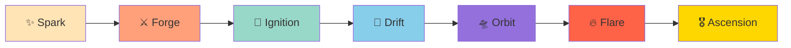
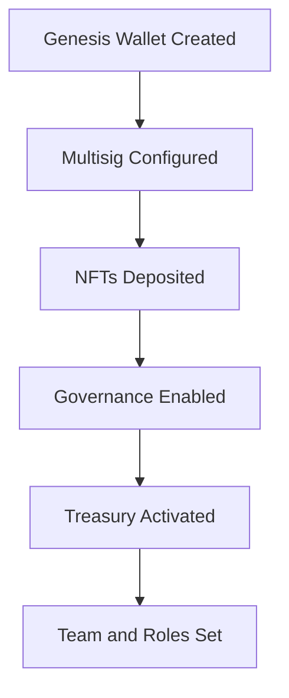
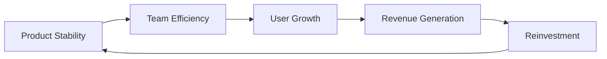

# Seven Phase Lifecycle

## The Journey from Idea to Independence

Every venture in Studio3 follows a carefully designed seven-phase journey, each with specific goals, challenges, and rewards. This progression system ensures ventures develop sustainably while maintaining community support.

## Phase Overview

### The Complete Journey



### Quick Reference

| Phase | Duration | Goal | Success Rate |
|-------|----------|------|-------------|
| **Spark** | 1-2 weeks | Validate idea & gather initial support | 60% |
| **Forge** | 3-5 days | Select committed founder | 100% |
| **Ignition** | 2-4 weeks | Form team & create MVP | 75% |
| **Drift** | 2-6 months | Find product-market fit | 40% |
| **Orbit** | 6-12 months | Achieve sustainable operations | 65% |
| **Flare** | 6-18 months | Scale with capital | 80% |
| **Ascension** | 1-2 months | Graduate to sovereignty | 95% |

*Someone always wins the Forge

## Phase 1: Spark ✨

### Where Ideas Take Flight

<div class="arena-card">

<h3>🎯 Objective</h3>
<p>Transform a remixed IP concept into a validated venture idea with initial community support.</p>

<p><strong>Key Activities:</strong></p>

<ul>
<li><strong>Create Spark NFT from Flambette marketplace</strong></li>
<li><strong>Enter idea into Spark Arena</strong></li>
<li><strong>Gather initial belief signals</strong></li>
<li><strong>Refine concept based on feedback</strong></li>
<li><strong>Build initial supporter base</strong></li>

</ul>
<p><strong>Success Criteria:</strong></p>

<ul>
<li><strong>A threshold of community support</strong></li>
<li><strong>At least 10 unique supporters</strong></li>
<li><strong>Clear problem-solution fit</strong></li>
<li><strong>Feasible execution plan</strong></li>

</ul>
</div>

### Spark Dynamics

!!! info "Spark Competition"
    Multiple Sparks compete simultaneously in the Arena. Only the top performers advance to Forge phase. Competition drives quality and ensures only the strongest ideas proceed.

### Common Pitfalls

- **Vague Concepts**
- Be specific about what you're building
- **Ignoring Feedback**
- Community wisdom is valuable
- **Overselling**
- Unrealistic promises backfire
- **Poor Timing**
- Market readiness matters

## Phase 2: Forge ⚔️

### The Battle for Leadership

<div class="arena-card">

<h3>🏆 Objective</h3>
<p>Determine the most capable founder through competitive dueling.</p>

<p><strong>Duel Format:</strong></p>

<ul>
<li><strong>Entry</strong>: by application, nothing to put up</li>
<li><strong>Preparation</strong>: 72 hours to prepare pitch</li>
<li><strong>Presentation</strong>: Live pitch to community</li>
<li><strong>Voting</strong>: community decision by Signal</li>
<li><strong>Winner Takes All</strong>: Signal NFT + leadership rights</li>

</ul>
<p><strong>Evaluation Criteria:</strong></p>

<ul>
<li><strong>Vision clarity and ambition</strong></li>
<li>Technical capability</li>
<li>Leadership experience</li>
<li>Community engagement</li>
<li>Commitment level</li>

</ul>
</div>

### Forge Strategies

!!! tip "Winning the Forge"
    1. **Demonstrate Expertise** - Show deep domain knowledge
    2. **Rally Support** - Build coalitions before the duel
    3. **Present Clear Plan** - Specific milestones win votes
    4. **Show Commitment** - Make the scale of what you are taking on clear
    5. **Engage Actively** - Answer all questions thoroughly

## Phase 3: Ignition 🚀

### Building the Foundation

<div class="arena-card">

<h3>🔨 Objective</h3>
<p>Form Container DAO, assemble team, and deliver initial MVP.</p>

<p><strong>Critical Tasks:</strong></p>

<ul>
<li><strong>Create Container DAO structure</strong></li>
<li>Mint Halo NFT (locked)</li>
<li>Recruit 2-4 team members</li>
<li>Define technical architecture</li>
<li>Build and launch MVP</li>
<li>Secure initial users/testers</li>

</ul>
<p><strong>Milestones:</strong></p>

<p>1. DAO formation complete</p>
<p>2. Core team assembled</p>
<p>3. Technical spec approved</p>
<p>4. MVP launched</p>
<p>5. First users onboarded</p>

</div>

### Container DAO Setup



### Resource Allocation

| Resource | Ignition Allocation | Purpose |
|----------|--------------------|---------|
| **Development** | 40% | MVP creation |
| **Team Building** | 30% | Recruitment & onboarding |
| **Marketing** | 20% | Initial awareness |
| **Operations** | 10% | Legal, admin, tools |

## Phase 4: Drift 🌊

### Finding Your Current

<div class="arena-card">

<h3>🎯 Objective</h3>
<p>Iterate rapidly to find product-market fit through community feedback.</p>

<p><strong>Key Characteristics:</strong></p>

<ul>
<li><strong>High experimentation rate</strong></li>
<li>Rapid pivots allowed</li>
<li>Constant user feedback</li>
<li>Flexible milestone adjustments</li>
<li>Community-guided development</li>

</ul>
<p><strong>Success Indicators:</strong></p>

<ul>
<li><strong>User retention > 40%</strong></li>
<li>Organic growth starting</li>
<li>Clear use case emerging</li>
<li>Positive unit economics</li>
<li>Community enthusiasm growing</li>

</ul>
</div>

### Drift Strategies

!!! warning "Navigating Drift"
    This phase has the highest failure rate. Success requires:

- **Humility** to accept when things aren't working
- **Speed** to iterate faster than resources deplete
    * **Focus** to avoid feature creep

    * **Communication** to maintain supporter confidence

### Pivot Mechanics

When pivoting during Drift:

1. **Announce Early** - Don't surprise supporters
2. **Explain Reasoning** - Data-driven decisions
3. **Maintain Vision** - Core mission stays consistent
4. **Reset Milestones** - New direction, new goals
5. **Re-engage Community** - Rebuild confidence

## Phase 5: Orbit 🛸

### Achieving Stability

<div class="arena-card">

<h3>🎯 Objective</h3>
<p>Establish sustainable operations with consistent growth and reliable delivery.</p>

<p><strong>Orbit Characteristics:</strong></p>

<ul>
<li><strong>Predictable revenue/usage</strong></li>
<li>Stable team operations</li>
<li>Consistent milestone achievement</li>
<li>Growing community confidence</li>
<li>Clear scaling path</li>

</ul>
<p><strong>Key Metrics:</strong></p>

<ul>
<li><strong>MRR/MAU growth</strong>: 10%+ monthly</li>
<li>Milestone success rate: 80%+</li>
<li>Team retention: 90%+</li>
<li>User satisfaction: 4.5/5+</li>
<li>Community forecast confidence: rising</li>

</ul>
</div>

### Operational Excellence



### Orbit Milestones

| Milestone Type | Frequency | Typical Goals |
|----------------|-----------|---------------|
| **Product** | Monthly | Feature releases, improvements |
| **Growth** | Bi-weekly | User acquisition, retention |
| **Revenue** | Monthly | MRR targets, unit economics |
| **Team** | Quarterly | Hiring, culture, processes |

## Phase 6: Flare 🔥

### Igniting Growth

<div class="arena-card">

<h3>🚀 Objective</h3>
<p>Scale rapidly with external capital and aggressive expansion.</p>

<p><strong>Flare Characteristics:</strong></p>

<ul>
<li><strong>External funding rounds</strong></li>
<li>Aggressive hiring</li>
<li>Market expansion</li>
<li>Product scaling</li>
<li>Brand building</li>

</ul>
<p><strong>Capital Sources:</strong></p>

<ul>
<li><strong>Traditional VCs (now interested)</strong></li>
<li>Strategic partners</li>
<li>Revenue-based financing</li>
<li>Strategic investment</li>
<li>Community rounds</li>

</ul>
</div>

### Scaling Strategies

!!! success "Flare Playbook"
    1. **Prove Unit Economics** - Show profitable growth potential
    2. **Build Investor Pipeline** - Leverage Studio3 network
    3. **Maintain Transparency** - Keep community informed
    4. **Execute Flawlessly** - High stakes, high scrutiny
    5. **Prepare for Ascension** - Plan graduation early

### Growth Metrics

```text
Flare Phase Target Metrics:

• Monthly Growth Rate: Minimum 25% month-over-month growth
• Team Size: Typically between 20-50 employees
• Market Share: Target 5% share in your specific segment
• Customer Acquisition Cost: Should be less than 1/3 of customer lifetime value
• Gross Margins: Target above 70% for software ventures
```

## Phase 7: Ascension 🎖️

### Achieving Sovereignty

<div class="arena-card">

<h3>👑 Objective</h3>
<p>Graduate from Studio3 oversight to complete independence.</p>

<p><strong>Ascension Requirements:</strong></p>

<ul>
<li><strong>All phases successfully completed</strong></li>
<li>Sustainable business model proven</li>
<li>Team fully autonomous</li>
<li>Community support maintained</li>
<li>Buyback funds available</li>

</ul>
<p><strong>The Buyback Process:</strong></p>

<p>1. Initiate graduation request</p>
<p>2. Final Anchor validation</p>
<p>3. Buyback Spark + Signal NFTs</p>
<p>4. Unlock Halo NFT</p>
<p>5. Transfer Genesis Wallet control</p>
<p>6. Achieve full sovereignty</p>

</div>

### Sovereignty Benefits

!!! info "What Sovereignty Unlocks"

    - **Full Control**: Complete ownership of all assets
    - **Sub-Studio Rights**: Launch your own ventures
    - **Alumni Network**: Lifetime Studio3 benefits
    - **Mentor Status**: Become an Anchor yourself
    - **Legacy Recognition**: Permanent ecosystem honor

### Post-Ascension Options

1. **Continue Independently**
   - Run as traditional company
2. **Launch Sub-Studio**
   - Create venture studio
3. **Acquire Others**
   - Buy struggling ventures
4. **Go Public**
   - Traditional exit paths
5. **Stay Connected**
   - Remain in ecosystem

## Phase Progression Rules

### Moving Forward

<div class="arena-card">

<h3>📈 Advancement Criteria</h3>

<p><strong>General Requirements:</strong></p>

<ul>
<li><strong>Complete all phase milestones</strong></li>
<li>Maintain community support (>60% belief)</li>
<li>Pass Anchor validation</li>
<li>Meet minimum duration</li>
<li>Achieve phase-specific metrics</li>

</ul>
<p><strong>Special Cases:</strong></p>

<ul>
<li><strong>Fast Track</strong>: Exceptional ventures can accelerate</li>
<li><strong>Extended Duration</strong>: Complex ventures may need more time</li>
<li><strong>Phase Skipping</strong>: Not allowed - all phases required</li>
<li><strong>Regression</strong>: Can fall back during Drift only</li>

</ul>
</div>

### Failure Modes

!!! danger "When Ventures Fail"

- **Spark**: Idea doesn't gather support → NFT remains tradeable
- **Forge**: No suitable founder emerges → Spark returns to Arena
- **Ignition**: Can't build MVP → Dissolution, unreleased rewards returned
- **Drift**: No product-market fit → Pivot or dissolve
- **Orbit**: Can't sustain operations → Acquisition candidate
- **Flare**: Growth stalls → Return to Orbit or exit
- **Ascension**: Can't afford buyback → Remain in Flare

## Success Patterns

### What Works

<div class="grid cards">
    <div class="card">
        <h4>🎯 Clear Vision</h4>
        <p>Successful ventures maintain consistent core vision while adapting execution</p>
    </div>
    <div class="card">
        <h4>🤝 Community First</h4>
        <p>Those who engage deeply with supporters succeed more often</p>
    </div>
    <div class="card">
        <h4>⚡ Rapid Iteration</h4>
        <p>Fast learners navigate phases more successfully</p>
    </div>
    <div class="card">
        <h4>📊 Data Driven</h4>
        <p>Decisions based on metrics outperform intuition</p>
    </div>
</div>

## Phase-Specific Resources

### Support Systems

| Phase | Primary Support | Secondary Support |
|-------|----------------|------------------|
| **Spark** | Community feedback | Idea refinement tools |
| **Forge** | Pitch coaching | Debate preparation |
| **Ignition** | Technical mentors | DAO setup guides |
| **Drift** | Product advisors | Pivot frameworks |
| **Orbit** | Operations experts | Scaling playbooks |
| **Flare** | Growth hackers | Fundraising support |
| **Ascension** | Legal counsel | Buyback financing |

## Your Phase Journey

### Getting Started

1. **Assess Readiness** - Do you have a strong IP combination?
2. **Study Patterns** - Learn from successful phase transitions
3. **Build Network** - Connect with phase-specific experts
4. **Plan Ahead** - Know requirements for next phase
5. **Execute Publicly** - Transparency builds trust

## Next Steps

- Master the [Milestone System](milestones.md) for each phase

- Understand [Progression Rules](progression.md) in detail
- Learn about [Container DAO Setup](../senders-guide/container-dao.md) for Ignition
- Study [Ascension Planning](../senders-guide/ascension-planning.md) early